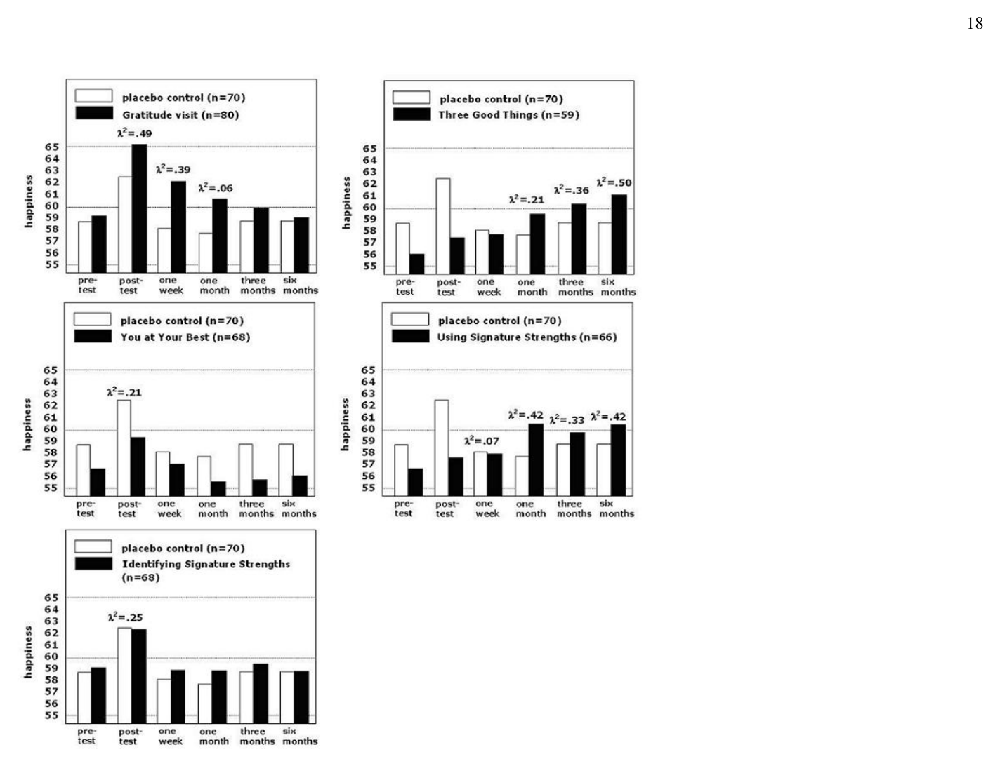
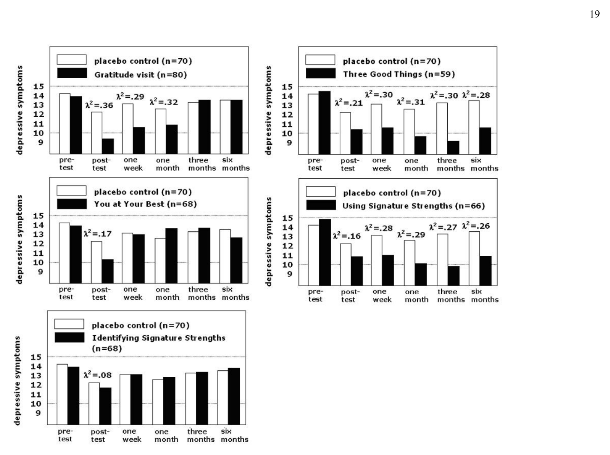
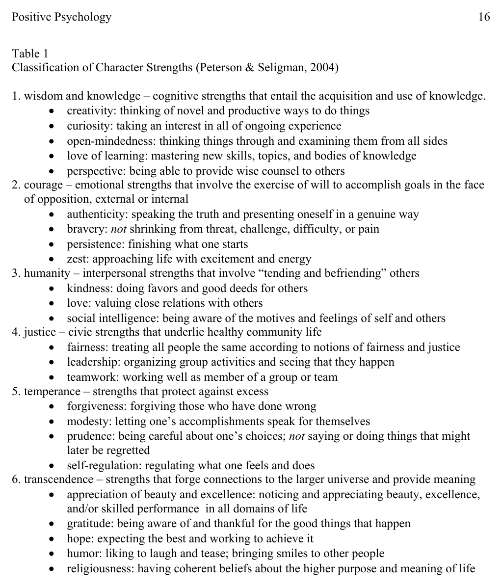

# 正向心理學的進展：介入措施的實證驗證

作者: 馬丁・塞利格曼、崔西・斯汀、朴南淑與克里斯多福・彼得森

## 標題與摘要

*PDF 第 1 頁*

Martin E. P. Seligman 與 Tracy A. Steen——賓夕法尼亞大學；Nansook Park——羅德島大學；以及 Christopher Peterson——密西根大學。（最終修訂日期：2005 年 4 月 22 日）

摘要

正向心理學在過去五年間蓬勃發展。我們回顧其近期進展，包括書籍、會議、課程與研討會。

我們討論新近建立的品格優勢與美德分類；這套分類是對《精神疾病診斷與統計手冊》（DSM）的正向補充。我們也提出若干跨文化研究發現，顯示這些優勢與美德竟具有令人驚訝的普遍性。

最後，我們聚焦於提升個人幸福感的心理介入。在一項採六組、隨機分派、安慰劑對照的網路研究中，我們檢驗了五項據稱能提升幸福感的介入，以及一項看似合理的控制練習。

我們發現，其中三項介入能持久提升幸福感並減少憂鬱症狀。正向介入可補充以減輕痛苦為目的的傳統介入，而這或許有朝一日會成為正向心理學留給實務工作的傳承。

*PDF 第 2 頁*

自《American Psychologist》以千禧年專刊介紹新興的正向心理學科學以來，已過了五年；正向心理學研究正向情緒、正向品格與正向制度（Seligman & Csikszentmihalyi, 2000）。正向心理學家借鑑曾有效推進精神疾病科學的方法，研究心理健康與福祉。

正向心理學家奠基於 Rogers（1951）、Maslow（1954, 1962）、Jahoda（1958）、Erikson（1963, 1982）、Vaillant（1977）、Deci 與 Ryan（1985）、Ryff 與 Singer（1996）等眾多學者的開創性工作，增進了我們對於正向情緒、正向品格及促使其發展的制度，如何、為何以及在何種條件下得以蓬勃發展的理解（例如 Cameron, Dutton, & Quinn, 2003; Easterbrook, 2003; Gardner, Csikszentmihalyi, & Damon, 2001; Kahneman, Diener, & Schwarz, 1999; Murray, 2003; Vaillant, 2000）。

正向心理學家並未聲稱自己發明了美好人生，也未聲稱由自己開啟其科學研究；然而，「正向心理學」這個統攝性名詞的價值，在於整合過去散落而分歧、探討何者使人生最值得活的理論與研究脈絡（Peterson & Park, 2003）。在基礎科學持續發展之際，其他研究也正走向應用領域（Linley & Joseph, 2004）。

我們能否運用從精神疾病科學與實務中學到的知識，建立一套讓人持久更幸福的實務方法？換言之，我們能否建立以證據為基礎的正向心理學實務？

本文首先回顧正向心理學近來的發展。接著，我們說明與人是否能變得持久更幸福有關的基礎研究，然後呈現我們以隨機、安慰劑對照設計嚴格檢驗之幸福感介入的結果。

## 進展報告

*PDF 第 2 頁*

正向心理學是一個統攝性名詞，涵蓋對正向情緒、正向品格特質與促成其發展之制度的研究。正向心理學的研究發現旨在補充我們對人類痛苦、弱點與失常的既有知識，絲毫不是要取而代之。

其目的在於對人類經驗——高峰、低谷以及兩者之間的一切——形成更完整且平衡的科學理解。我們相信，完整的心理學科學與實務應包含對痛苦、幸福感及兩者互動的理解，也應包含經驗證、能減輕痛苦與提升幸福感的介入；這兩者是可以區分的工作。

書籍。

過去五年間，除了《American Psychologist》分別於 2000 年 1 月推出的專刊與 2001 年 1 月推出的專題之外，學術與大眾媒體上確實已出現數百篇相關文章。相關書籍也開始問世。

例如可參見《The Handbook of Positive Psychology》（Snyder & Lopez, 2002）、《Authentic Happiness》（Seligman, 2002）、《A Psychology of Human Strengths》（Aspinwall & Staudinger, 2003）、《Flourishing》（Keyes & Haidt, 2003）、《Positive Psychological Assessment: A Handbook of Models and Measures》（Lopez & Snyder, 2004）、《Positive Psychology in Practice》（Linley & Joseph, 2004）以及《Handbook of Methods in Positive Psychology》（Ong & van Dulmen, in press）。這些著作彙整了實證發現與此科學所採用的方法。

我們特別要介紹自己的著作《Character Strengths and Virtues: A Handbook and Classification》（《品格優勢與美德：手冊與分類》，簡稱「CSV」；Peterson & Seligman, 2004）。CSV 是迄今自覺地從正向心理學觀點推動、企圖最為宏大的計畫；它希望對心理福祉所發揮的作用，能如美國精神醫學學會的《精神疾病診斷與統計手冊》（DSM；1994）對使人失能之心理疾患所發揮的作用。

*PDF 第 3 頁*

CSV 描述並分類能使人蓬勃發展的優勢與美德。我們尊重 DSM，但也試圖避免其中若干問題：清楚交代某些項目納入 CSV、另一些項目遭排除的理由；將正向特質視為程度不一的個體差異，而非全有或全無的類別；並發展具信度與效度的評估策略，包括問卷、調查、訪談及知情者報告（Peterson, Park, & Seligman, 2005）。

CSV 的整體架構奠基於世界各地幾乎所有文化都認可的六項統攝性美德：智慧、勇氣、仁愛、正義、節制與超越（Dahlsgaard, Peterson, & Seligman, 2005）。在每項美德之下，我們辨識出符合下列準則的特定品格優勢：

- • 普遍性——獲得不同文化的廣泛認可
• 實現性——有助於廣義的個人實現、滿足與幸福感
• 道德價值——因其本身而受重視，而非僅作為達成目的的手段
• 不貶抑他人——能提升見證者，使其產生欽佩而非嫉妒

- • 負面的反義面——具有明顯且屬於「負面」的反義特質
• 特質性——是一種具有可證明之普遍性與穩定性的個體差異
• 可測量性——研究者已成功將其作為個體差異加以測量
• 獨特性——在概念或實證上不與其他品格優勢重複

- • 典範人物——在某些人身上有格外鮮明的展現
• 神童——某些兒童或青少年會早熟地展現此優勢
• 選擇性缺失——在某些人身上完全不存在
• 制度——社會會透過實踐與儀式，有意識地將其作為培養目標

表 1 列出這套分類，其中包含 24 項品格優勢。雖然我們避免主張其具普世性，但下述證據似乎足以支持其具有普遍性。

CSV 的每一章都說明我們對各項品格優勢已知與未知的內容：典型案例、共識定義、歷史與跨文化背景、測量、擁有或欠缺該優勢的相關因素與後果、發展、促成與抑制條件、性別差異，以及培養該優勢的介入措施。我們期望本書能成為未來研究與新介入方案的架構。

目前已出現三項令人驚訝的實證發現。第一，我們發現，世界各地及美國境內的成年人，對 24 項品格優勢的相對認同排序呈現高度相似（Park, Peterson, & Seligman, 2005a）。

在從亞塞拜然到委內瑞拉的 40 個不同國家中，最普遍獲認同（「最像我」）的優勢是仁慈、公平、真誠、感恩與開明；排名較低的優勢則一貫包括審慎、謙遜與自我調節。各國排序之間的相關非常強，約在 .80 左右，跨越了文化、族群與宗教差異。

美國 50 州也呈現相同的優勢高低排序——唯一例外是宗教性在南方稍為明顯——而且此結果不受性別、年齡、紅州或藍州及教育程度影響。我們的結果可能揭示了普遍人性，以及／或者一個可運作的社會最低限度所需的品格條件（參見 Bok, 1995）。

*PDF 第 4 頁*

第二，比較美國成年人與美國青少年的優勢剖面後，雖然整體排序一致，但其一致程度明顯低於美國成年人與我們研究過的任何其他國家成年人之間的一致程度（Park, Peterson, & Seligman, 2005b）。

希望、團隊合作與熱忱在美國青少年中比成年人更常見；相較之下，對美的欣賞、真誠、領導力與開明則在成年人中更常見。當我們開始關注如何有意培養品格優勢時，除了思考如何從無到有建立某些優勢，也應同樣關心如何避免另一些優勢在邁向成年的過程中逐漸流失（Park & Peterson, in press b）。

第三，儘管品格優勢的部分定義在於它能促成自我實現，但「心靈型」優勢——熱忱、感恩、希望與愛——與生活滿意度的關聯，比好奇心、熱愛學習等較偏認知型的優勢更為穩健（Park, Peterson, & Seligman, 2004）。

我們在成年人與青少年中都發現此一模式；縱貫資料也顯示，這些「心靈型」優勢能預示其後的生活滿意度（Park, Peterson, & Seligman, 2005b）。另有一項值得注意的發現：父母的自我調節雖與父母自身的生活滿意度關聯不強，卻與其子女的生活滿意度呈正相關（Park & Peterson, in press a）。

會議、中心與課程。

參與踴躍的學術會議定期舉行。例如，2004 年 10 月，來自 23 個國家的 390 多位正向心理學家，參加了在華盛頓特區舉行的第三屆國際正向心理學高峰會。歐洲正向心理學網絡於 2004 年 7 月在義大利主辦第二屆研討會，吸引全球 300 人參與。

年輕研究者會申請參加每年夏季舉辦的正向心理學研習營；這是一項為期一週的計畫，讓職涯初期的研究者交流想法，並接受正向心理學資深學者的指導。

- 2005、2006 與 2007 年的 5 月 15 日至 6 月 30 日，Medici II 將在賓夕法尼亞大學舉行；數十位科學家與學者將齊聚合作推動五項計畫：（a）幸福感對生產力與健康的影響；（b）國家福祉指標；（c）靈性與成功老化；（d）心理資本；以及（e）建立中文與西班牙文，並最終涵蓋所有主要語言群體的正向心理學網站。

正向心理學網絡資助了 50 多個研究團隊，涵蓋全球各大學 150 多位科學家。第一批正向心理學中心現已成立，分別位於賓夕法尼亞大學、密西根大學、伊利諾大學與克萊蒙研究大學。

目前，美國數十所大學及歐洲院校已在大學部與研究所開設正向心理學課程，使學生接觸到一項觀念：除了研究人的問題所在，研究人做對了什麼同樣合理。

Martin Seligman 與 Ben Dean 開設了一門 48 小時的電話課程「Authentic Happiness Coaching」，內容涵蓋正向心理學的原理、測驗與介入。參與者超過 1,000 人，包括臨床與諮商心理師、教練、教育工作者、精神科醫師、一般醫師及人事經理。

第一個碩士學位課程將由賓夕法尼亞大學提供；應用正向心理學碩士班將於 2005 年 9 月開課。該學位公布後一個月內，便收到兩百多份申請。

正向心理學研究的廣泛傳播，意味著整體心理學界開始理解：人生的正向面向同樣可以進行嚴謹、值得尊重的科學研究。正向心理學專門網站蓬勃增加，其中較受歡迎的包括：www.apa.org/science/positivepsy.html、www.bus.umich.edu/Positive/、www.reflectivehappiness.com 與 www.positivepsychology.org/。

可透過 www.positivepsychology.org/pospsy.htm#PP%20Listserve 加入正向心理學電子郵件論壇。媒體對正向心理學展現高度興趣，全球報章雜誌已刊出數百篇相關文章。

*PDF 第 5 頁*

《Time》雜誌以本領域為 2005 年 1 月 17 日號的封面主題，並以幾乎整期篇幅介紹其科學進展與實務意涵。

資助者相當慷慨。Atlantic Philanthropies、Annenberg Foundation、Sunnylands Trust、Mayerson Foundation、Templeton Foundation、Hovey Foundation、Gallup Foundation、美國教育部等機構均提供大額補助，以支持科學研究與研究成果的傳播。

介入措施。

本文其餘部分聚焦於提升個人幸福感之心理介入的成效；從許多層面而言，這正是正向心理學工作的關鍵成果。首先，必須對「幸福感」一詞加以提醒：我們認為幸福感在科學上是個難以駕馭的概念；要嚴謹研究它，至少必須將其拆解為三條彼此不同且定義較清楚的「幸福」途徑（Seligman, 2002）：（a）正向情緒與愉悅（愉悅人生）；（b）投入（投入人生）；以及（c）意義（意義人生）。

我們近期的研究顯示，人們會依其追求的人生類型而呈現穩定差異；此外，最滿意的人是同時朝三種人生取向努力的人，其中投入與意義所占的權重最大（Peterson, Park, & Seligman, in press）。

我們仍繼續使用「幸福感」一詞，但僅以非理論性的方式，用它標示正向心理學整體工作的目標，並共同指稱正向情緒、投入與意義。

我們之所以應關注培養幸福感的介入，有一個不那麼顯而易見的理由：幸福感並非附帶現象。過去幾年浮現的一項重要事實是，幸福感具有因果作用，帶來的益處遠不只感覺良好。

幸福的人更健康、更成功，也更積極參與社會，而其因果方向是雙向的（Lyubomirsky, King, & Diener, 2004）。我們期待持續研究幸福感的相關因素與後果。

幸福感的因果效力，使我們的研究團隊將焦點放在一項實務議題上：培養幸福感的介入措施。

## 正向心理學能讓人持久地更幸福嗎？

*PDF 第 5 頁*

從佛陀、1960 年代的人類潛能運動，到 Michael Fordyce（1977, 1983）的開創性工作，再到 1990 年代的自我提升產業，至少已有一百種宣稱能持久提升幸福感的「介入」被提出。我們蒐集了這些介入，並將其中約 40 種提煉為可重複、可編製成操作手冊的形式。

其中哪些真正有效，哪些充其量只是安慰劑？針對藥物或心理治療，已有一條回答這類問題的標準途徑——隨機分派、安慰劑對照的隨機對照試驗（RCT）設計；同一方法也可用來驗證究竟有哪些做法能建立人生的正向面向。

我們起初先在大學部與研究所課程中教導學生進行這些練習，之後又透過電話課程教導各類心理健康專業人員。我們看見許多效果強烈的「個案研究」（參與者不約而同地以「改變人生」描述其經驗），因而受到鼓舞，決定透過隨機對照試驗加以檢驗，確認它們在嚴格測試下是否有效。

我們也考慮過另一種可能：根本沒有任何練習能讓人持久變得更幸福。關於享樂跑步機、適應，以及正向情感之遺傳性的研究，全都暗示人會迅速適應生活中的正向改變，並回到原本的幸福感基準水準（Brickman & Campbell, 1971; Kahneman, 1999; Lykken & Tellegen, 1996）。

然而，由於我們所見個案軼事的效果如此強烈，我們決定繼續推進，並以隨機分派、安慰劑對照試驗檢驗這些介入。

*PDF 第 6 頁*

以下我們將詳細說明迄今接受此類檢驗的五項練習之成效。首先處理兩項方法學問題：（a）我們如何測量幸福感與憂鬱；以及（b）我們如何透過網路實施介入並蒐集結果資料。

## 幸福感與憂鬱的測量

*PDF 第 6 頁*

憂鬱的測量相當直接。我們採用 CES-D 症狀量表（Radloff, 1977）。

然而，在檢視既有的幸福感測量工具後，我們找不到一套能平行涵蓋三種幸福形式（正向情緒、投入與意義）的「症狀量表」。雖已有實用的整體幸福感測量工具（例如 Fordyce, 1977; Lyubomirsky & Lepper, 1999），但它們無法讓研究者更細緻地區分幸福感水準，尤其是在量尺高分端；分數分布偏斜，因此形成偏低的天花板效應。

這些工具也未涵蓋愉悅人生、投入人生與意義人生的所有「症狀」。

為了捕捉我們推測在幸福感介入後可能逐週出現的幸福感上升變化，我們建立了一項新測量工具：Steen 幸福指數（SHI）。我們明確以貝克憂鬱量表（BDI；Beck, Ward, Mendelson, Mock, & Erbaugh, 1961）作為模型。

正如 BDI 對憂鬱症狀的變化敏感，我們也將 SHI 設計成能敏銳偵測幸福感水準的變化，尤其是向上的變化。SHI 包含 20 個題目，要求參與者閱讀一系列陳述，並從每組陳述中選出最符合自己目前狀態的一項。

SHI 題目反映三種幸福人生（愉悅人生、投入人生與意義人生）：體驗並品味愉悅、在引人投入的活動中忘我，以及參與具有意義的活動。作答選項從負向（= 1）到極度正向（= 5）。例如：

- A. 大多數時候我都感到無聊。（1）
B. 大多數時候，我對正在做的事既不覺得無聊，也不感興趣。（2）
C. 大多數時候，我對正在做的事感興趣。（1）
D. 大多數時候，我對正在做的事相當感興趣。（2）
E. 大多數時候，我對正在做的事深深著迷。（3）

以數百名成年受試者進行的先導研究顯示，此量表分數與其他幸福感測量具有高度聚合關係（如預期，與 Lyubomirsky 與 Lepper［1999］的整體幸福感量表相關為 r = .79，與 Fordyce［1977］的幸福感量表相關為 r = .74），但其分布也如我們所期望，更接近鐘形。

此外，即使控制先前的 SHI 分數，一週期間的 SHI 分數變化仍能敏銳反映受試者自陳之正向與負向事件的發生。

## 網路介入措施

*PDF 第 6 頁*

我們透過網路招募參與者、實施介入並蒐集資料（Prochaska, DiClemente, Velicer, & Rossi, 1993）。在介入研究的這個階段，此便利樣本十分符合我們的需求，因為我們的網站（www.authentichappiness.org）免費提供許多正向心理問卷，平均每天有 300 名新註冊者。

不過，我們也認為，就科學依據而言，此樣本至少不遜於大學二年級學生或臨床機構志願者，甚至可能更優。透過網路蒐集資料的一項較小優點，是省去研究者輸入資料的程序，也一併避免相關人為錯誤。

更大的優點是在大樣本研究中具有顯著的成本效益。支付網站開發與維護費用後，若研究具有足夠統計檢定力，資料蒐集幾乎不再產生額外成本；我們也已將網站提供給有興趣的研究者使用。

在科學上更為重要、也更具爭議的問題，是取樣可能存在偏差。Gosling、Vazire、Srivastava 與 John（2004）比較了透過網路蒐集的調查資料與傳統方法蒐集的調查資料。

他們的結論是：（a）網路資料的多樣性與傳統方法蒐集的資料相當；（b）自願參與的受試者……

*PDF 第 7 頁*

參與網路研究的人，在心理困擾程度上並不高於傳統研究的參與者；而且（c）網路研究的參與者，並不比傳統樣本中的參與者更不認真看待研究，也不會更不願意提供正確資訊。

我們認為本研究樣本確實存在偏差，但偏差的方向與研究目的相關。樣本較偏向希望變得更幸福的人，而這正是我們介入措施的最終目標群體。

我們不希望將研究結果推論至不想變得更幸福的人，或必須受到強迫才願意接受心理測驗的人。基於這些考量，我們選擇使用網際網路進行研究。

## 研究程序

*PDF 第 7 頁*

在第一次大型隨機對照試驗中，我們設計了五項幸福感練習與一項安慰劑對照練習。每項練習皆透過網際網路提供，並可在一週內完成。

其中一項練習著重於培養感恩，兩項著重於增進對自身最正向特質的覺察，另兩項則著重於辨識品格優勢。在這項隨機、安慰劑對照研究中，我們將這些練習的效果，與一項我們認為合理的安慰劑對照活動相比：連續一週書寫早期記憶日誌。

我們追蹤參與者六個月，並定期測量其憂鬱症狀與幸福感。

我們在為 Seligman（2002）的《Authentic Happiness》（《真實的快樂》）所建立的網站中設置「幸福感練習」連結，並從網站訪客中招募便利樣本。網站將本研究描述為一個協助測試新型幸福感提升練習的機會。

在約一個月期間，我們共招募 577 名成年參與者，其中男性占 42%，女性占 58%。近三分之二的參與者（64%）年齡介於 35 至 54 歲。

在受調查的參與者中，39% 擁有四年制大學學位，27% 曾接受研究所教育。值得注意的是，僅有 4% 的參與者在高中畢業後未曾接受進一步教育或職業訓練，這也限制了本研究結果的可推廣性。

與其自陳教育程度一致，約四分之三的參與者將自己的收入水準歸類為「平均」或以上。樣本主要為白人（77%）。

網站訪客被告知，他們將接受的練習不保證能使其更幸福，而且可能分派到無實質作用的安慰劑練習。我們一開始並未為完成練習提供任何金錢誘因。

不過，為確保良好的追蹤率，我們告知參與者，在完成練習後一週、一個月、三個月與六個月的追蹤測驗後，即可參加抽獎。獎項包括一份 500 美元獎金與三份各 100 美元獎金。

參與者同意所列條款後，先回答一系列基本人口統計問題，並完成前述兩份問卷：SHI 與 CES-D。接著，參與者會隨機獲派一項練習。

研究人員鼓勵參與者印出或抄下練習說明，並在接下來一週將其放在方便取用之處。完成指定練習後，他們須返回網站填寫追蹤問卷。

參與者會收到電子郵件提醒。第一封提醒信於該週初寄出，內容重述其指定練習的操作說明。

他們也會收到聯絡資訊，若有任何問題或疑慮，可與研究人員聯繫。第二封提醒信於該週稍晚寄出，提醒參與者返回網站填寫追蹤問卷：「再次感謝您參與本研究。請記得於［相關日期］前返回［網址］，提供您對練習的回饋並完成追蹤問卷。」

參與者完成練習並返回網站後，會再次完成前測時使用的相同幸福感與憂鬱測量。此外，參與者還須回答一項「操弄檢核」問題，以評估其是否確實在指定期間內依照說明完成練習（以是或否計分）。

*PDF 第 8 頁*

在完成基線問卷的 577 名參與者中，有 411 人（71%）完成全部五次追蹤評估。中途退出研究者與持續參與者在基線幸福感或憂鬱分數上並無差異，六項練習的退出率也沒有顯著差異。

我們的分析僅納入完成所有追蹤問卷的參與者¹。

如有需要可索取各項練習的詳細說明；以下為每項練習的概述：

- 安慰劑對照練習：早期記憶——參與者須連續一週每晚書寫自己的早期記憶。

- 感恩拜訪——參與者有一週時間撰寫感謝信，之後親自交給一位曾對自己格外友善、卻從未得到妥善致謝的人。

- 生活中的三件好事——參與者須連續一週每晚寫下當天進行順利的三件事及其原因。此外，他們還須為每件好事提供因果解釋。

- 最佳狀態下的你——參與者須書寫一段自己處於最佳狀態的經歷，接著反思故事中展現的個人優勢。他們須連續一週每天重讀故事一次，並反思自己所辨識出的優勢。

- 以新方式運用標誌性優勢——參與者須在 www.authenichappiness.org 線上完成我們的品格優勢量表，並取得針對其排名前五項（「標誌性」）優勢的個人化回饋（Peterson, Park, & Seligman, 2005）。接著，他們須連續一週每天以嶄新且不同的方式運用其中一項優勢。

- 辨識標誌性優勢——這是前述練習的精簡版本，但未要求參與者以新方式運用標誌性優勢。參與者須完成問卷、記下排名最高的五項優勢，並在接下來一週更常運用這些優勢。

## 介入措施的結果

*PDF 第 8 頁*

其中兩項練習——以新方式運用標誌性優勢與三件好事——可在六個月內提升幸福感並減少憂鬱症狀。另一項感恩拜訪練習則帶來持續一個月的大幅正向改變。

另外兩項練習與安慰劑對照，對幸福感與憂鬱症狀產生了正向但短暫的效果。不出所料，參與者在規定的一週結束後，主動自行持續練習的程度，中介了長期效益。

以下提供更多細節。我們先採用變異數分析（ANOVA），再進行事前規劃對比，比較參與者在以下各時間點的分數：前測、立即後測（完成一週練習後）、後測後一週、一個月、三個月與六個月。

圖 1 與圖 2 依指定練習呈現參與者的幸福感與憂鬱分數。圖中亦列出各條件的樣本數，以及介入組在基線分數與不同追蹤時間點分數之間達統計顯著（p < .05）對比時所對應的效果量²。

幸福感分數的整體變異數分析（六種條件 × 六個時間點）顯示，時間具有顯著效果（F = 26.38, p < .001），條件與時間的交互作用亦達顯著（F = 12.38, p < .001）。

憂鬱分數也呈現相似結果：時間效果顯著（F = 39.77, p < .001），條件與時間的交互作用亦達顯著（F = 5.21, p < .001）。

所有條件（包括安慰劑對照條件）的參與者，在立即後測時皆傾向於……

*PDF 第 9 頁*

……具有較高的幸福感與較低的憂鬱程度（即完成一週練習後；見圖 1 與圖 2）。然而，一週後及其後每個測量時間點，安慰劑對照條件的參與者均與基線狀態沒有差異。

如圖 1 與圖 2 所示，在立即後測時（完成一週指定練習後），感恩拜訪條件的參與者幸福感較高、憂鬱程度較低。事實上，感恩拜訪條件的參與者呈現了整項研究中最大的正向改變。

這種幸福感的提升與憂鬱症狀的減少，在一週與一個月追蹤評估時仍然維持。然而到了三個月，感恩拜訪條件的參與者，其幸福感與憂鬱程度已不再優於基線。

三件好事練習的參與者，從後測後一個月開始呈現有益效果。在一個月追蹤時，他們的幸福感高於基線、憂鬱程度低於基線；而且在三個月與六個月追蹤時，這些改善仍持續存在。

以新方式運用標誌性優勢條件的參與者也出現類似的長期改善。其立即效果不如三件好事條件明顯，但從一個月追蹤起及其後各時間點，該條件參與者的幸福感均高於基線，憂鬱程度則低於基線。

相較之下，精簡版辨識標誌性優勢條件的參與者只在立即後測呈現效果，之後便不再有效。同樣地，最佳狀態下的你條件也僅在立即後測呈現效果。

是什麼造成了長期效益？無論獲派何種練習，參與者都被明確要求只進行一週的指定練習。

在一週、一個月、三個月與六個月的追蹤聯繫中，我們詢問參與者是否確實自行持續練習超過一週。我們假設，持續進行介入練習會中介追蹤時的正向結果。

為檢驗此假設，我們進行變異數分析，以參與者自陳的練習遵從度與是否持續練習作為自變項，以幸福感分數作為依變項。我們也以憂鬱（CES-D）分數為依變項進行相同類型的分析。

結果相當直接。練習遵從度在所有時間點對幸福感分數皆有顯著效果，並在一個月追蹤時對憂鬱分數具有顯著效果。

是否持續練習與練習遵從度之間的交互作用，對幸福感分數達顯著，顯示持續進行練習的參與者最為幸福。當以 CES-D 為依變項時，此交互作用亦達顯著，再次顯示有效練習的長期效果（圖 2）在自行持續練習者身上最為明顯。

## 正向介入措施的未來

*PDF 第 9 頁*

我們發現了能使人們持續提升幸福感的特定介入措施，並相信本研究對正向介入、乃至臨床介入的未來，具有或大或小的啟示。我們在一項具相當規模的隨機分派實驗中，將五項幸福感介入操作化，並與安慰劑對照比較。

結果發現，有兩項介入——書寫每天發生的三件好事及其原因，以及以新方式運用品格的標誌性優勢——可使人在長達六個月後仍有較高幸福感（且較少憂鬱）。另一項感恩拜訪介入則帶來大幅正向改變，但僅維持一個月。

六個月離「從此幸福快樂」還很遠，但我們的結果顯示，即使在童話之外，持續提升幸福感也可能辦得到。效果量達「中等」或更大，這與一種廣泛信念相矛盾；該信念認為，追求幸福是……

*PDF 第 10 頁*

……徒勞無功的，因為人們必然會適應，或因享樂設定點無法改變。

本研究要求參與者進行一週的指定練習，之後定期返回網站接受追蹤評估。無論獲派何種練習，參與者——甚至包括對照組——在立即後測時的平均幸福感都較高，憂鬱程度也較低。

此一模式凸顯了縱貫式、安慰劑對照設計在此類研究中的關鍵重要性，尤其當參與者期待自己會變得更幸福時更是如此。隨著研究持續並探索更多練習，我們將發現愈來愈多無實質作用的練習；即使這些練習原本被設計成主動提升福祉的方式，仍可作為安慰劑對照。

參數式變化也可發揮對照組功能，藉由逐步增加練習強度或持續時間，建立「劑量－反應」曲線。

此領域的先驅（例如 Fordyce, 1977, 1983）發現，包含多種練習的「霰彈式」介入可提升幸福感。在介入測試的早期便辨識具體有效成分並不常見；我們的研究超越了單純展示效果，然而要釐清介入如何發揮作用的細節，當然仍需進一步研究。

我們也建議採用隨機分派的安慰劑對照。僅僅因期待獲益而完成專業人員指定的某項活動，或許就足以在短期內振奮情緒、提升幸福感（Frank, 1973）。

這種情況在本研究樣本中可能尤其明顯，因為樣本由希望變得更幸福、重視研究結果，並認為 www.authentichappiness.org 是可信權威的人所組成。基線 CES-D 分數顯示，參與者平均處於輕度憂鬱狀態。

參與者很可能有動機嘗試各種方法讓自己感覺更好，而大多數人的確有所改善——至少是暫時如此。因此，安慰劑對照格外重要。

介入後一週，安慰劑對照組（早期記憶練習）的參與者，其幸福感與憂鬱症狀已回到基線水準，且直到六個月追蹤時皆維持在該水準。

被要求書寫自己處於最佳狀態故事的參與者——最佳狀態下的你——呈現與安慰劑相同的模式：完成一週練習後，幸福感立即提升，憂鬱症狀也立即降低，但兩者都未延續至後測之後。因此，我們認為這項練習至少在單獨使用時，並非有效介入。

我們特別加上「單獨使用」，是因為在尚未接受隨機對照試驗檢驗的多項練習方案中，我們會以此練習引介標誌性優勢介入。先講述一個展現自身最高優勢的引導故事，再進行有效的標誌性優勢練習，可能會放大其對幸福感與憂鬱的效益。

鑑於三項介入在單獨實施時便有效，因此有理由推測，一套正向介入組合——或許也納入單獨實施時無效的項目——很可能產生超越任何單一練習的有益效果。

任何治療其實都由這類組合構成：其中可能包含真正無效的做法、單獨使用時無效但在組合中有效的做法，以及始終有效的做法。我們已設計這類組合，並正在進行測試。

此外，這些單項練習是在「無人介入」的情況下，透過網站以電子方式提供。討論治療效果時，常強調與治療師關係的力量，並認為唯有先建立此關係，特定介入才會有效。

在沒有人際治療聯盟的情況下仍發現有益效果，顯示這些練習中存在強而有力的特定有效成分。我們相信，若由技巧純熟的臨床工作者或教練引導，可能產生更大的效益。

我們目前針對由真人提供之練習組合所進行的研究發現，在減輕憂鬱與提升幸福感方面具有大型效果量；相較之下，本研究報告的大多是……

*PDF 第 11 頁*

……中等效果量。

我們只要求參與者進行一週的指定練習，並未建議他們之後繼續進行。

事後回顧，我們認為一週可能不足以讓以新方式運用標誌性優勢條件與三件好事條件的參與者，發展出充分的技巧與經驗。然而，這兩種條件的參與者仍持續從練習中獲益，效果最長達六個月。

我們發現，持續從練習中獲益的參與者，正是那些在未經我們要求的情況下，自發地把練習延續至規定的一週之外的人。

我們認為，這兩種介入都是能隨練習而進步、而且「有趣」的技巧，因此能夠自我維持。不同於節食減重等許多治療結果，這些練習具有「自我增強」作用。

在這些條件中，多數參與者在被問及是否自行持續練習時，回答「是」。

隨著我們持續開發與測試練習，將特別關注這些練習融入個人日常作息的容易程度，以及其自我維持歷程。

要個人定期安排正式的感恩拜訪也許不切實際，但多數人每天都能抽出時間，以充分而真誠的方式向某人表達感謝。在任何正向介入組合中，最佳做法可能是交錯安排能立即產生影響的練習（例如感恩拜訪），以及容易融入日常生活的練習。

本研究尚未回答的一項重要問題是：就幸福感介入而言，是否「愈多愈好」？既然以新方式運用標誌性優勢、三件好事與感恩拜訪三項練習皆有效，將它們全部指派給希望變得更幸福的人，是否合理？

若答案是肯定的，是否存在最佳順序？是否有某些人格類型只對部分練習有效，而對其他練習無效？

我們目前正以參數方式檢驗練習數量，並測試不同排列順序，期望強化其對幸福感與憂鬱的效果。

正向狀態的測量仍需更多研究。許多幸福感研究者認同，幸福感必然是主觀的，本質上就是個人所定義的幸福（例如 Lyubomirsky, Sheldon, & Schkade, in press）。

如果幸福感完全取決於當事人的觀點，那麼自陳測量便是唯一適當的測量方式。然而，我們認為這種做法不夠穩健：即使我們最能判斷自己當下有多幸福，對於過去何時以及在何種情境下感到幸福，我們未必是準確的歷史記錄者。

研究者面臨的一項挑戰，是發展更完善、以行為為基礎且針對特定領域的評估工具。我們推測，工作生產力與身體健康可能呈現與主觀幸福感相同的模式；我們期待有一天，生產力與健康指標能與主觀測量一同使用。

就我們所知，本研究是企圖最宏大的幸福感介入隨機分派安慰劑對照測試；然而，我們的介入效果僅在便利樣本中獲得驗證。此群體多數教育程度良好、為白人，且經濟狀況寬裕。

此外，他們處於輕度憂鬱狀態，並有動機變得更幸福。未來若研究這些練習對幸福感遠高於本研究群體、或憂鬱程度遠高於本研究群體，以及來自其他背景者的效用，可能會揭示正向介入普遍適用性的界限。

我們目前正與身心障礙者輔導員合作探討此問題；這些輔導員的主要任務，是協助身心障礙者獲得高品質就業與高品質生活。

我們也忍不住推測，幸福感練習可能證實對憂鬱症具有治療作用。重要的是，這些介入也能持續減少憂鬱症狀，而我們在其他研究中發現，此效果相當巨大。

一般而言，在治療工作中……

*PDF 第 12 頁*

……我們會正面處理心理疾患：教導焦慮者放鬆、教導憂鬱者反駁令人憂鬱的想法、協助受衝突困擾者洞察衝突來源，也讓強迫症患者發現，即使不執行其儀式行為，災難也不會發生。

事實上，所有「談話」治療都有一項未明說的前提：談論自己的困擾，並藉由正面面對來克服它們。我們將正向介入視為以困擾為焦點之治療的補充，也是治療師箭袋中的另一支箭。

依照目前的定義，心理治療是人們前往談論自身困擾與弱點的地方；或許未來，它也會成為人們前往培養優勢的地方。也許到了《American Psychologist》千禧年專刊出版十週年時，我們便能回顧這些發展。

至少從亞里斯多德時代起，學者、哲學家與宗教領袖便一直思考：「我們如何才能持續變得更幸福？」然而直到最近，臨床心理學與精神醫學唯一的指導問題仍是：「我們如何減少痛苦？」

我們相信，心理學與精神醫學已為痛苦問題找到部分答案，而這是一個良好的開始。但即使這個問題得到完整解答，心理學的使命也不應止於此。

很少有人會僅因自己較不憂鬱、較不焦慮、較不憤怒，就感到完全滿足。我們主張，心理學專業未來的使命不僅應包括減少痛苦，也應提升地球上幸福感的總量。

## 參考文獻

*PDF 第 13 頁*

American Psychiatric Association (1994). Diagnostic and statistical manual of mental disorders (4th ed.). Washington, DC: author.

Aspinwall, L. G., & Staudinger, U. M. (Eds.) (2003). A psychology of human strengths: Fundamental questions and future directions for a positive psychology. Washington, DC: American Psychological Association.

Beck, A. T., Ward, C. H., Mendelson, M. N., Mock, J., & Erbaugh, J. (1961). An inventory for measuring depression. Archives of General Psychiatry, 4, 561-571.

Bok, S. (1995). Common values. Columbia, MO: University of Missouri Press.

Brickman, P., & Campbell, D. T.(1971). Hedonic relativism and planning the good society. In M. H. Appley (Ed.), Adaptation-level theory (pp. 287-305). New York: Academic Press.

Cameron, K. S., Dutton, J. E., & Quinn, R. E. (Eds.) (2003). Positive organizational scholarship: Foundations of a new discipline. San Francisco: Berrett-Koehler.

Dahlsgaard, K., Peterson, C., & Seligman, M. E. P. (2005). Shared virtue: The convergence of valued human strengths across culture and history. Review of General Psychology.

Deci, E. L. & Ryan, R. M. (1985). Intrinsic motivation and self-determination in human behavior. New York: Plenum Press.

Easterbrook (2003). The progress paradox: How life gets better while people feel worse. New York: Random House.

Erikson, E. (1963). Childhood and society (2nd ed.). New York: Norton.

Erikson, E. (1982). The life cycle completed. New York: Norton.

Fordyce, M. W. (1977). Development of a program to increase personal happiness. Journal of Counseling Psychology, 24, 511-520.

Fordyce, M. W. (1983). A program to increase happiness: Further studies. Journal of Counseling Psychology, 30, 483-498.

Frank, J. (1973). Persuasion and healing: A comparative study of psychotherapy (2nd ed.). Baltimore, MD: Johns Hopkins University Press.

Gardner, H., Csikszentmihalyi, M., & Damon, W. (2001). Good work: When excellence and ethics meets. New York: Basic Books.

Gosling, S. D., & Vazire, S., Srivastava, S., & John, O. P. (2004). Should we trust Web-based studies? A comparative analysis of six preconceptions about Internet questionnaires. American Psychologist, 59, 93-104.

Jahoda, M. (1958). Current concepts of positive mental health. New York: Basic Books.

Kahneman, D. (1999). Objective happiness. In D. Kahneman, E. Diener, & N. Schwarz (Eds.), Well-being: The foundations of hedonic psychology (pp. 3-25). New York: Russell Sage.

Kahneman, D., Diener, E., & Schwarz, N. (Eds.). (1999). Well-being: The foundations of hedonic psychology. New York: Russell Sage Foundation.

Keyes, C. L. M., & Haidt, J. (Eds.) (2003). Flourishing: Positive psychology and the life well lived. Washington DC: American Psychological Association.

Linley, P. A., & Joseph, S. (Eds.). Positive psychology in practice. Hoboken, NJ: John Wiley & Sons.

Lopez, S. J., & Snyder, C. R. (Eds.) (2004). Positive psychological assessment: A handbook of models and measures. Washington, DC: American Psychological Association.

Lykken, D., & Tellegen, A. (1996). Happiness is a stochastic phenomenon. Psychological Science, 7, 186-189.

Lyubomirsky, S., & Lepper, H. S. (1999). A measure of subjective happiness: Preliminary reliability and construct validation. Social Indicators Research, 46, 137-155.

Lyubomirsky, S., King, L. A., & Diener, E. (2004). Is happiness a strength?: An examination of

*PDF 第 14 頁*

the benefits and costs of frequent positive affect. Unpublished manuscript, University of California, Riverside.

Lyubomirsky, S., Sheldon, K. M., & Schkade, D. (in press). Pursuing happiness: The architecture of sustainable change. Review of General Psychology.

Maslow, A. H. (1954). Motivation and personality. New York: Harper & Row.

Maslow, A. H. (1962). Toward a psychology of being. Princeton, NJ: Van Nostrand.

Murray, C. (2003). Human accomplishment: The pursuit of excellence in the arts and sciences, 800 B.C. to 1950. New York: HarperCollins.

Ong, A. D., & van Dulmen, M. (Eds.) (in press). Handbook of methods in positive psychology. New York: Oxford University Press

Park, N., & Peterson, C. (in press). Assessing strengths of character among adolescents: The development and validation of the Values in Action Inventory of Strengths for Youth. Journal of Adolescence. (a)

Park, N., & Peterson, C. (in press). The cultivation of character strengths. In M. Ferrari & G. Poworowski (Eds.), Teaching for wisdom. Mahwah, NJ: Erlbaum. (b)

Park, N., Peterson, C., & Seligman, M. E. P. (2004). Strengths of character and well-being. Journal of Social and Clinical Psychology, 23, 603-619.

Park, N., Peterson, C., & Seligman, M. E. P. (2005). Character strengths in forty nations and fifty states. Unpublished manuscript, University of Rhode Island. (a)

Park, N., Peterson, C., & Seligman, M. E. P. (2005). Strengths of character and well-being among youth. Unpublished manuscript, University of Rhode Island. (b)

Peterson, C., & Park, N. (2003). Positive psychology as the evenhanded positive psychologist views it. Psychological Inquiry, 14, 141-146.

Peterson, C., Park, N., & Seligman, M. E. P. (2005). Assessment of character strengths. In G. P. Koocher, J. C. Norcross, & S. S. Hill, III (Eds.), Psychologists’ desk reference (2nd ed., pp. 93-98). New York: Oxford University Press.

Peterson, C., Park, N., & Seligman, M. E. (in press). Orientations to happiness and life satisfaction: The full life versus the empty life. Journal of Happiness Studies.

Peterson, C. & Seligman, M. E. P. (2004). Character strengths and virtues: A handbook and classification. Washington, D.C.: American Psychological Association.

Prochaska, J. O., DiClemente, C., Velicer, W. F., & Rossi, J. S. (1993). Standardized, individualized, interactive, and personalized self-help programs for smoking cessation. Health Psychology, 12, 399-405.

Radloff, L. S. (1977). The CES-D scale: A self-report depression scale for research in the general population. Applied Psychological Measurement, 1, 385-401.

Rogers, C. R. (1951). Client-centered therapy: Its current practice, implications, and theory. Boston: Houghton Mifflin.

Ryff, C. D., & Singer, B. (1996). Psychological well-being: Meaning, measurement, and implications for psychotherapy research. Psychotherapy and Psychosomatics, 65, 14-23.

Seligman, M. E. P. (2002). Authentic happiness. New York: Free Press.

Seligman, M. E. P., & Csikszentmihalyi, M. (2000). Positive psychology: An introduction. American Psychologist, 55, 5-14.

Snyder, C. R., & Lopez, S. J. (Eds.). (2002). Handbook of positive psychology. New York: Oxford University Press.

Vaillant, G. E. (1977). Adaptation to life. Boston: Little, Brown.

Vaillant, G. E. (2000). Aging well. Boston: Little, Brown.

## 作者註與註腳

*PDF 第 15 頁*

本研究獲得 Annenberg/Sunnylands Trust Foundation、Atlantic Philanthropies、John Marks Templeton Foundation，以及美國國家心理健康研究院（NIMH）計畫 MH63430 的支持。

通訊請寄至 Martin E. P. Seligman，Positive Psychology Center, University of Pennsylvania, 3701 Market Street, Philadelphia, Pa, 19104；seligman@psych.upenn.edu；或 Christopher Peterson，Department of Psychology, University of Michigan, 525 East University, Ann Arbor, MI 48109-1109；chrispet@umich.edu。

註腳

1. 年齡較大者的幸福感較高（r = .18, p < .001），憂鬱程度也較低（r = -.17, p < .001）。無論在基線或任何後續追蹤評估中，性別與族群皆與幸福感或憂鬱分數無關。

在分析中，我們起初控制了年齡，但結果並未受到影響，因此本文僅呈現未經調整的平均數。

2. 透過變異數分析（ANOVA）進一步逐一比較各項介入與安慰劑對照條件，可更詳細地呈現這些效果。

就幸福感而言，時間具有主要效果（感恩拜訪：F = 39.13, p < .001；三件好事：F = 8.76, p < .001；最佳狀態的自己：F = 26.77, p < .001；以新方式運用標誌性優勢：F = 8.56, p < .001；辨識標誌性優勢：F = 24.94, p < .001），

條件與時間的交互作用則出現在感恩拜訪（F = 6.88, p < .001）、三件好事（F = 16.47, p < .001）及以新方式運用標誌性優勢（F = 17.91, p < .001），但未出現在最佳狀態的自己（F = 1.75, ns）或辨識標誌性優勢（F = .35, ns）。

就憂鬱症狀而言，時間具有主要效果（感恩拜訪：F = 20.91, p < .001；三件好事：F = 14.43, p < .001；最佳狀態的自己：F = 10.37, p < .001；以新方式運用標誌性優勢：F = 13.35, p < .001；辨識標誌性優勢：F = 6.59, p < .001），

條件與時間的交互作用則出現在感恩拜訪（F = 4.62, p < .001）、三件好事（F = 5.15, p < .001）、最佳狀態的自己（F = 2.83, p < .02）及以新方式運用標誌性優勢（F = 4.56, p < .001），但未出現在辨識標誌性優勢（F = .20, ns）。

## 表 1：品格優勢分類

*PDF 第 16 頁*

品格優勢的分類（Peterson & Seligman, 2004）

1. 智慧與知識——涉及知識獲取與運用的認知優勢。• 創造力：思考新穎且有效率的做事方式 • 好奇心：對正在發生的一切經驗抱持興趣 • 開放思維：把事情想透，並從各個角度加以審視 • 熱愛學習：精通新技能、新主題與知識體系 • 洞察力：能為他人提供明智的建議

2. 勇氣——面對外在或內在阻力時，運用意志以達成目標的情緒優勢。• 真誠：說真話，並以真實的方式呈現自己 • 勇敢：面對威脅、挑戰、困難或痛苦時不退縮 • 毅力：完成自己開始的事情 • 熱忱：以興奮與活力面對生活

3. 人性——涉及照料他人並與他人建立友誼的人際優勢。• 仁慈：為他人提供幫助並行善 • 愛：重視與他人的親密關係 • 社會智能：覺察自己與他人的動機及感受

4. 正義——構成健全社群生活基礎的公民優勢。• 公平：依照公平與正義的理念平等對待所有人 • 領導力：組織團體活動並確保活動付諸實行 • 團隊合作：身為團體或團隊成員時能良好合作

5. 節制——防止過度的優勢。• 寬恕：原諒曾做錯事的人 • 謙遜：讓自己的成就自行說明一切 • 審慎：謹慎做選擇；不說或不做日後可能後悔的事 • 自我調節：調節自己的感受與行為

6. 超越——建立與更廣大宇宙的連結並賦予意義的優勢。• 欣賞美與卓越：在生活各領域中注意並欣賞美、卓越及／或高超表現 • 感恩：覺察並感謝發生的美好事物 • 希望：期待最好的結果，並努力使其實現 • 幽默：喜歡歡笑與開玩笑；為他人帶來笑容 • 宗教性：對人生更高層次的目的與意義持有連貫一致的信念

## 圖說

*PDF 第 17 頁*

圖 1．Steen 幸福感指數（SHI）分數。

圖中數值為效果量，對應介入組在該時間點相較於基線所呈現的統計顯著差異（p < .05）。若未顯示效果量，表示介入組與比較組之間沒有差異。

圖 2．流行病學研究中心憂鬱量表（CES-D）分數。

圖中數值為效果量，對應介入組在該時間點相較於基線所呈現的統計顯著差異（p < .05）。若未顯示效果量，表示介入組與比較組之間沒有差異。
